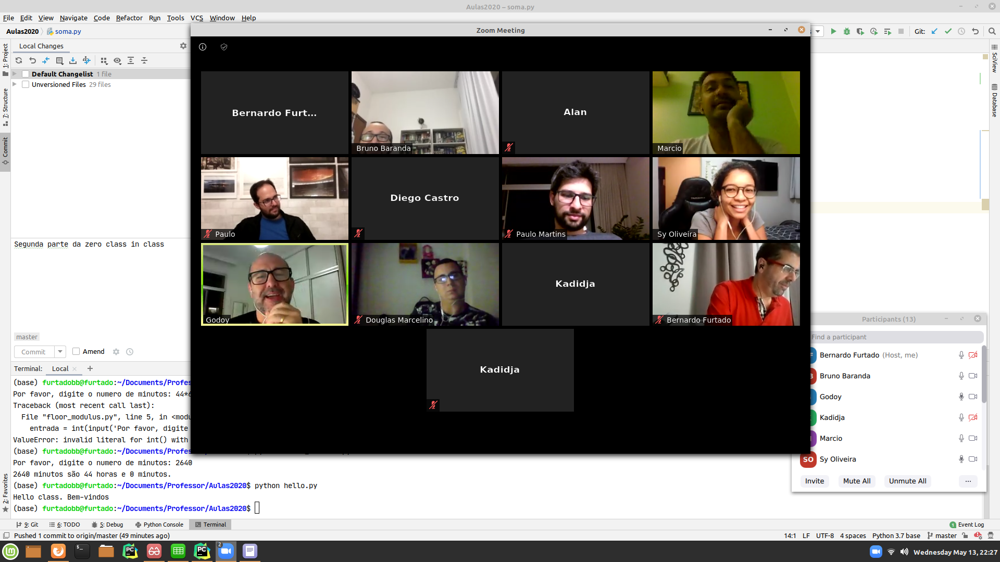

Title: Python zero class at Ipea!
Date: 2020-05-13 18:30
Category: class
Tags: home
Slug: class
Authors: B Furtado
Summary: A first (zero) class of Python.

## Students looked quite happy at the end.

{height=400px width=700px}

EDIT: update -- got a picture of class 1. Did not save it.